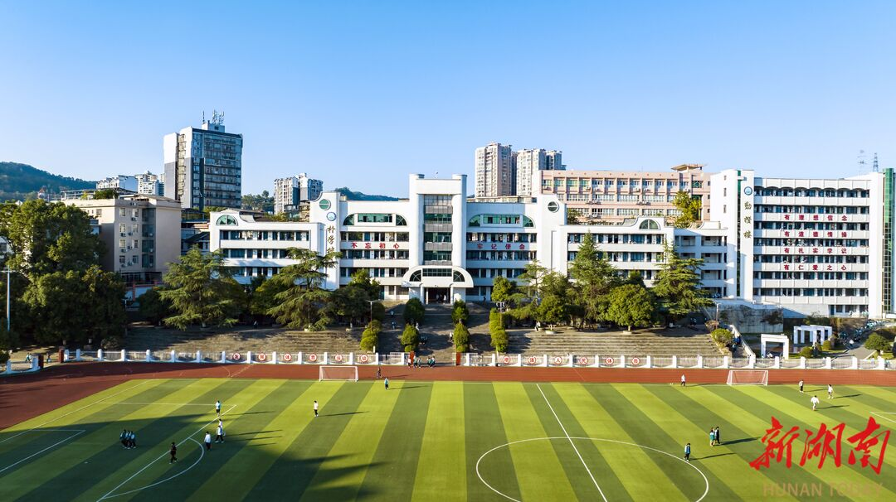

<section class="fy-home-hero" aria-labelledby="fy-home-title">
  

    
从州民中出发 · 看见更大的世界

    <h1 id="fy-home-title">每一种远方， 都有前人的足迹。</h1>
    
学校怎么选，专业怎么读，大学是什么样？ 让走过这段路的学长学姐，陪你一起找答案。

    <form class="fy-home-search" action="cases/" method="get" role="search" aria-label="搜索升学案例">
      <label for="fy-home-query" class="fy-sr-only">学校、专业或校友</label>
      <input id="fy-home-query" type="search" name="q" placeholder="搜索学校、专业、校友…" autocomplete="off">
      <button type="submit">找案例 →</button>
    </form>
    
<a href="cases/">浏览全部案例 ↗</a><a href="contribute/" data-fy-event="contribute_start">分享我的故事 ↗</a>

    <!-- AUTO-GEN: HOMEPAGE_STATS -->

  

    111
    份真实案例
  

  

    79
    所大学
  

  

    13
    届毕业生
  

    <!-- /AUTO-GEN: HOMEPAGE_STATS -->
  

  <figure class="fy-campus">
    <picture><source srcset="assets/images/campus-hero.webp" type="image/webp"></picture>
    <figcaption>故事从这里开始诚 · 朴 · 勤 · 勇</figcaption>
  </figure>
</section>

真实的经历，具体的参考
<h2>找到与你有关的故事</h2>
<a href="cases/">探索全部案例 →</a>

<!-- AUTO-GEN: LATEST_CASES -->
<article class="fy-case-card" data-case-id="d2793ca5af44611e" data-case-search="Andrew 哈尔滨工业大学（深圳） 计算机科学 珠三角 物理类 985 理工 跨省 深圳" data-case-year="2020" data-case-group="物理类">
  

    
A

    

      Andrew
      2020 届 · 物理类
    

  

  

    <h3 class="fy-case-card-school">哈尔滨工业大学（深圳）</h3>
    
计算机科学

    
高考 662 分 · 全省第 1254 名

    

      不要因为来自小地方，就默认自己看不到更大的世界。你能来到这里，说明你已经比很多人勇敢了；你能来到这里和全国各地的优秀青年齐聚一堂，说明你的能力获得了认可。接下来，只需要保持那份勇敢，继续往前走。
    

  

  

    985
    理工
    跨省
    深圳
  

  <a href="cases/earlier/Andrew-哈尔滨工业大学（深圳）/" class="fy-case-card-link" data-fy-event="case_card_click" data-fy-case="d2793ca5af44611e" aria-label="阅读Andrew的哈尔滨工业大学（深圳）案例">阅读这份故事 ↗</a>
</article>
<article class="fy-case-card" data-case-id="df244f81e59c75fe" data-case-search="George 莫纳什大学（Monash University） 经济与金融 墨尔本 物理类 海外 商科 墨尔本" data-case-year="2020" data-case-group="物理类">
  

    
G

    

      George
      2020 届 · 物理类
    

  

  

    <h3 class="fy-case-card-school">莫纳什大学（Monash University）</h3>
    
经济与金融

    
高考 492 分 · 全省第 95771 名

    

      不要瞻前顾后，不要顾此失彼，不要畏手畏脚，脚踏实地往前走，未来一定会握在自己的手里。
    

  

  

    海外
    商科
    墨尔本
  

  <a href="cases/earlier/George-莫纳什大学（Monash University）/" class="fy-case-card-link" data-fy-event="case_card_click" data-fy-case="df244f81e59c75fe" aria-label="阅读George的莫纳什大学（Monash University）案例">阅读这份故事 ↗</a>
</article>
<article class="fy-case-card" data-case-id="fedcc6e1e22aeff0" data-case-search="Sophie 复旦大学 广播电视学 上海 历史类 文科 跨省 上海 广播电视学 985" data-case-year="2022" data-case-group="历史类">
  

    
S

    

      Sophie
      2022 届 · 历史类
    

  

  

    <h3 class="fy-case-card-school">复旦大学</h3>
    
广播电视学

    
高考 638 分 · 全省第 54 名

    

      世界有浮力 放松 就能被托举
    

  

  

    文科
    跨省
    上海
    广播电视学
  

  <a href="cases/earlier/Sophie-复旦大学/" class="fy-case-card-link" data-fy-event="case_card_click" data-fy-case="fedcc6e1e22aeff0" aria-label="阅读Sophie的复旦大学案例">阅读这份故事 ↗</a>
</article>
<article class="fy-case-card" data-case-id="581434c0c5e8d325" data-case-search="挽风 湘西民族职业技术学院 畜牧兽医 湖南湘西 物理类 理科 本省 湖南湘西 畜牧兽医" data-case-year="2020" data-case-group="物理类">
  

    
挽

    

      挽风
      2020 届 · 物理类
    

  

  

    <h3 class="fy-case-card-school">湘西民族职业技术学院</h3>
    
畜牧兽医

    
高考 439 分

    

      &quot;人生或许有遗憾，但奋斗过的青春一定是最美的。
    

  

  

    理科
    本省
    湖南湘西
    畜牧兽医
  

  <a href="cases/earlier/挽风-湘西民族职业技术学院/" class="fy-case-card-link" data-fy-event="case_card_click" data-fy-case="581434c0c5e8d325" aria-label="阅读挽风的湘西民族职业技术学院案例">阅读这份故事 ↗</a>
</article>
<article class="fy-case-card" data-case-id="5fd70b7687f4259c" data-case-search="GL 电子科技大学 电子信息工程 西南 物理类 工科 西南 电子信息工程 985" data-case-year="2023" data-case-group="物理类">
  

    
G

    

      GL
      2023 届 · 物理类
    

  

  

    <h3 class="fy-case-card-school">电子科技大学</h3>
    
电子信息工程

    
高考 647 分 · 全省第 2600 名

    

      世界那么大，我却只是路过，周边那么小，但那确是我的人生。
    

  

  

    工科
    西南
    电子信息工程
    985
  

  <a href="cases/2023/GL-电子科技大学/" class="fy-case-card-link" data-fy-event="case_card_click" data-fy-case="5fd70b7687f4259c" aria-label="阅读GL的电子科技大学案例">阅读这份故事 ↗</a>
</article>
<article class="fy-case-card" data-case-id="bc2af4e167535cdd" data-case-search="k1v 清华大学 机械工程 -&gt; 自动化（转专业） 北京 物理类 985 理工 跨省 北京" data-case-year="2023" data-case-group="物理类">
  

    
k

    

      k1v
      2023 届 · 物理类
    

  

  

    <h3 class="fy-case-card-school">清华大学</h3>
    
机械工程 -&gt; 自动化（转专业）

    
高考 687 分 · 全省第 61 名

    

      不要怕走弯路，但在做决定之前，请先把能看的路都认真看一遍。选择之后，也不要反复美化那些没有走上的路；把脚下这条路走深、走稳，本身就是一种很重要的能力。
    

  

  

    985
    理工
    跨省
    北京
  

  <a href="cases/2023/k1v-清华大学/" class="fy-case-card-link" data-fy-event="case_card_click" data-fy-case="bc2af4e167535cdd" aria-label="阅读k1v的清华大学案例">阅读这份故事 ↗</a>
</article>
<!-- /AUTO-GEN: LATEST_CASES -->

从湘西，到更远的地方
<h2>看看前辈走进了哪些大学</h2>
<a href="universities/">全部大学 →</a>

<!-- AUTO-GEN: HOMEPAGE_UNIVERSITIES -->
<a href="universities/清华大学/" class="fy-school-card">
  清华大学
  已收录 2 人
  机械工程 -> 自动化（转专业） · 电气工程及自动化
</a>

<a href="universities/电子科技大学/" class="fy-school-card">
  电子科技大学
  已收录 1 人
  电子信息工程
</a>

<a href="universities/中央民族大学/" class="fy-school-card">
  中央民族大学
  已收录 1 人
  少数民族预科班/中国史
</a>

<a href="universities/西北民族大学/" class="fy-school-card">
  西北民族大学
  已收录 2 人
  自动化 · 汉语言文学
</a>

<a href="universities/中国刑事警察学院/" class="fy-school-card">
  中国刑事警察学院
  已收录 1 人
  刑事科学技术
</a>

<a href="universities/莫纳什大学-monash-university/" class="fy-school-card">
  莫纳什大学（Monash University）
  已收录 1 人
  经济与金融
</a>

<a href="universities/西南交通大学/" class="fy-school-card">
  西南交通大学
  已收录 1 人
  数学/基础数学/算术几何和代数几何
</a>

<a href="universities/湖南大学/" class="fy-school-card">
  湖南大学
  已收录 3 人
  电气工程及其自动化（转专业前为金融） · 预科到电气工程及其自动化 · 土木工程
</a>
<!-- /AUTO-GEN: HOMEPAGE_UNIVERSITIES -->

<section class="fy-community">
  

经验是一场接力
<h2>你走过的路， 也会照亮后来的人。</h2>
这是属于所有州民中人的手册。一个选择、一次尝试、一个提醒，都可能帮助正在寻找方向的学弟学妹。
<a class="fy-btn fy-btn-primary" href="contribute/" data-fy-event="contribute_start">分享你的升学故事 ↗</a>

  
<a href="portal/">和学长学姐聊聊 ↗</a>
QQ 与微信交流群、提问入口和实用工具。
<a href="about/">认识这本手册 ↗</a>
了解项目的起点，以及每一位参与共建的校友。

</section>
